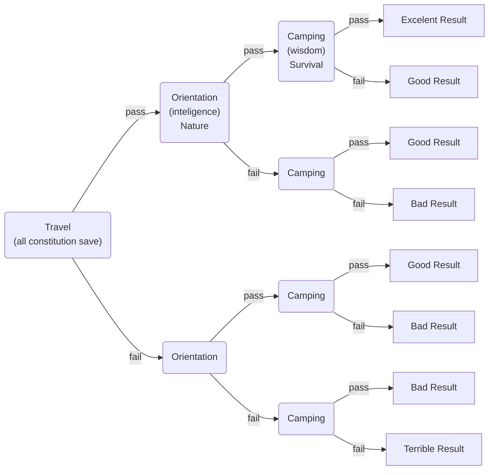

# Episode 16

## Lady of the Swamp pt. 2

---

### recap

Last we left off... fighting off a hoarder of will-o-wisps, your crew narrowly escaped through the depths of the swamp until you came upon the shack that the young elf woman Penelo implored you to find. Within it you expected to find her sister, but instead, found a magical device made of some unknown architecture, as well as a note describing some mysterious spell that seemed to deactivate said object. However, shortly after its operation was halted, and in turn the illusory spell, the shack reverted into its former state of decay. As a part of this process, Junk observed Penelo transform. Climbing from the elf's petite mouth a demon with long bladed arms, unmasking their fanged teeth, and, now that their prey were isolated, was beginning to pounce. 

### story

- Roll initiative
  - [Penelo Battle](https://www.dndbeyond.com/encounters/d6f5c0cf-26e1-491c-a16e-b2762887b812)
  - They fight a lot
- Loot the house
  - Among the various dead bodies and rags
    - Various forms of luggage, clothes now torn and ragged, bloodied 
    - On a dc10 investigation:
      - A large gold braclet (250gp)
      - A large well-made tapestry, rolled (250gp)
      - A silver broach (250gp)
    - On a dc 20 investigation, the above and:
      - An obsidian statuette outlined in fine gold (750gp)
    - On a dc 25+ investigation, the above and:
      - An old masterpiece painting rolled within a tube, the painting depicts a set of mountains illumnated by hevenly shafts of light, on a charisma saving dc. 15 you would think that whomever painted this… masterpiece was an extremely talented artist. Perhaps it was stollen froma museum? Perhaps the painter was ambushed by this monster on the road? Either way you’re sure this would fetch a high price at auction, or perhaps even a sizable reward if returned to its owner, or maybe you were thinking about starting a private collection (2500gp)
- The party continues to Seting
  - They venture through the swamp for apx 1 more day… they may get ambushed (roll on a table)

- Episode ends as they arrive at the “long wharf,” though however far west or east is determined by their overall check result 
  - Excellent, you’ve made it to the heart of seting
  - Good, in the eastern part of the city, but not quite to the city center
  - Bad, you end up in the middle/western part of the wharf
  - Terrible, you end up in the far western part of the city, in a hamlet
  - as you break through the treeline you begin to make out various buildings stretching off into the distance and as you get closer you begin to see various cranes and shipping crates, barrels, people (doing thing based on time of day)
- Where are you staying (camping check determines if they’re able to find a goodish place to sleep)